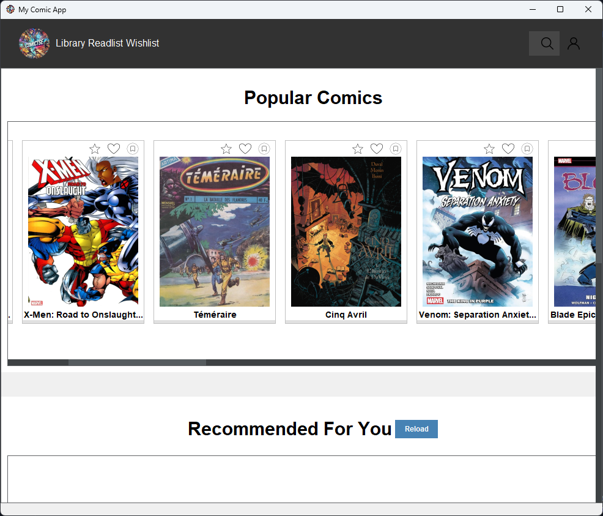
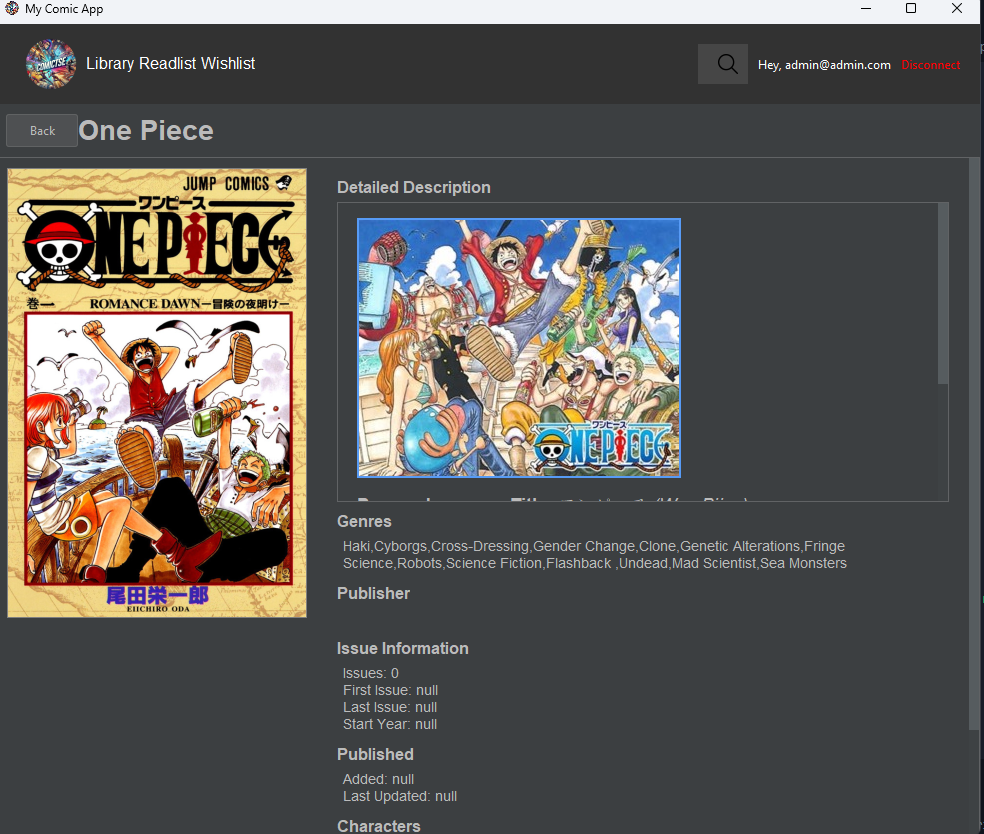
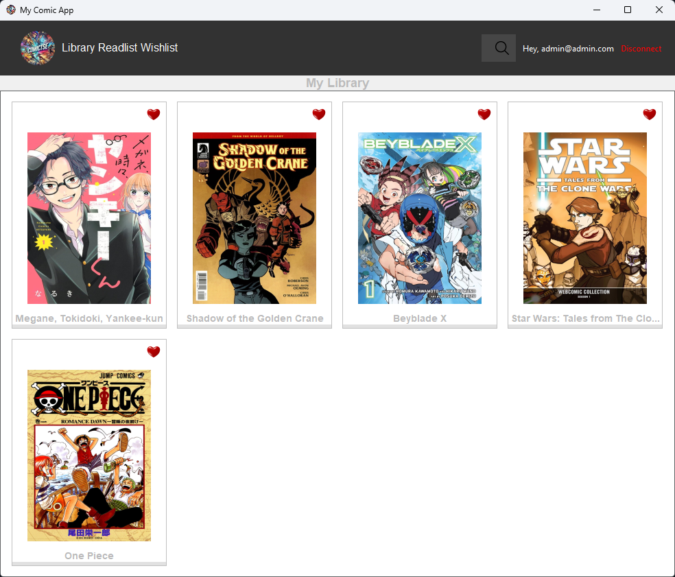
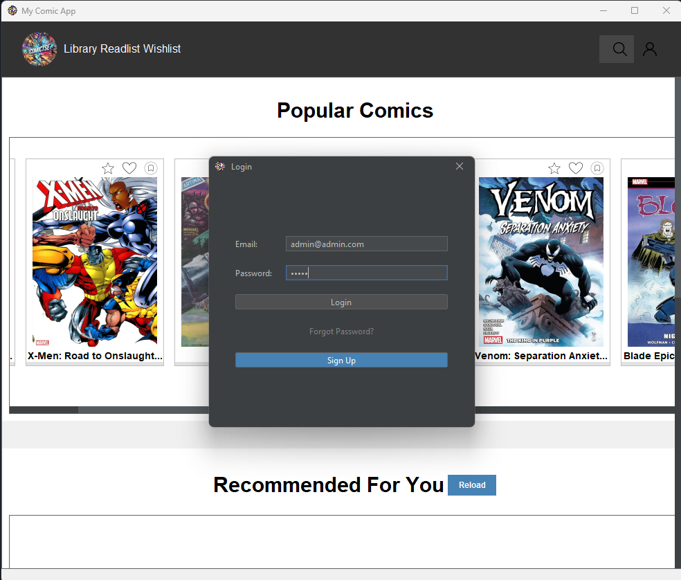

# Comic Application

## Description

The comic application is designed for comic book fans to search, view, and manage their comics. Users can even receive recommendations based on their personal library.

The application, built in Java, uses Swing for its user interface and FlatLaf for a modern look. It also includes a database for table creation and management.


## Features

- Search for comics by title and view information about the title (authors, characters, etc.)
- Search for characters, view details about them, and see the list of titles they appear in
- Get general recommendations for comics
- Create a personal account
- Manage a personal comic library (comics I own, am currently reading, and have finished reading)
- Get personalized reading recommendations based on your own library

## Visuals

### Main Interface

*The application's main interface with navigation and recommendations*

### Comic Details

*Detailed view of comic information including description, characters, and publication details*

### Library Management

*Personal library management with reading status tracking*

### Logging panel

*Logging panel with sign-up options and forget password options*
*There is an admin email that is created automatically to test, email: "admin@admin.com" password: "admin"*

Note: Screenshots show actual application interfaces and features in use.

## Installation

## Notice

-We use an api key that ComicVine provides after just logging.

-We use an smtp to do email verification using gmail, you need to get your own app password from google settings or change smtp provider

### Prerequisites

- Java Development Kit (JDK) 22 or later
- Git
- Maven

### Steps

1. Clone the repository:
    ```sh
    git clone https://devops.telecomste.fr/prinfo/2024-25/info4.git
    cd info4
    ```

2. Build the project:
    ```sh
    mvn clean install
    ```

3. Launch the application:
    ```sh
    java -jar .\target\ComicAPP-1.0-SNAPSHOT.jar           
    ```

## Usage

To start the application, simply run the `AppMain` file. The application will apply the modern FlatLaf look, create the necessary tables in the database, and launch the user interface.
